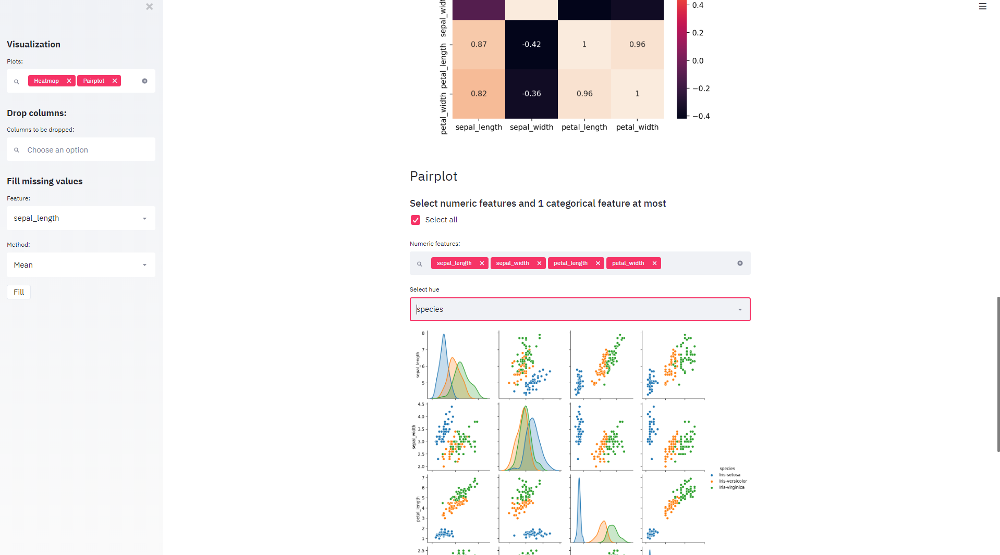

# streamlit-ML-initial-analysis
Machine Learning Streamlit app deployed to Heroku.

In this app you can upload a CSV file, pre-process your data, make some EDA, train/test split and make an initial prediction with Random Forest models.

In this repo you can download the python script and the classic IRIS.csv to test the app.

https://mlinitialanalysis.herokuapp.com

